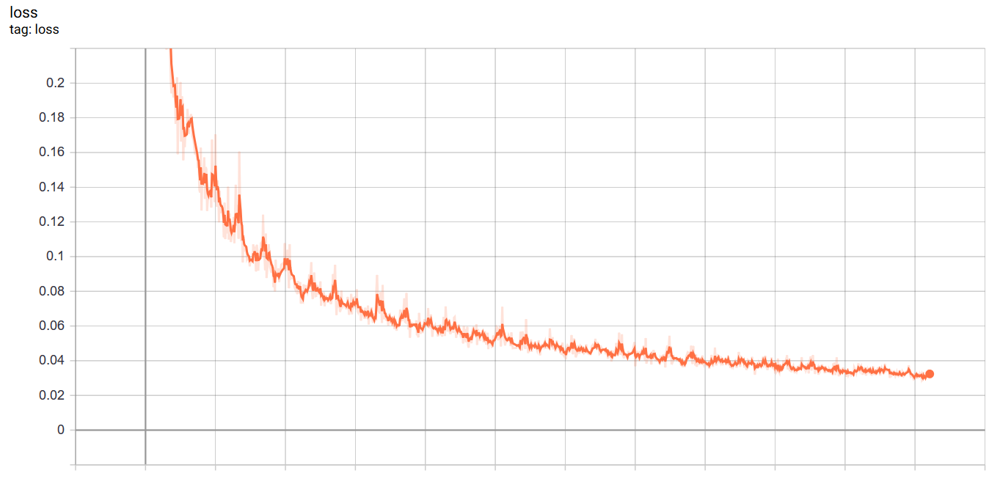
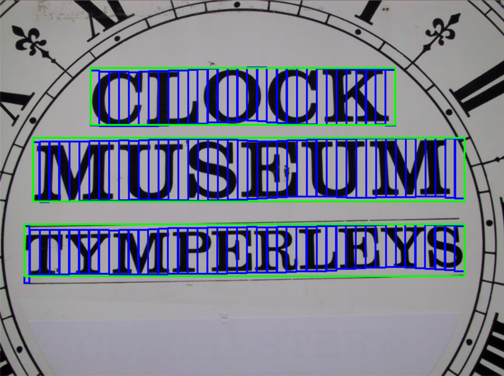
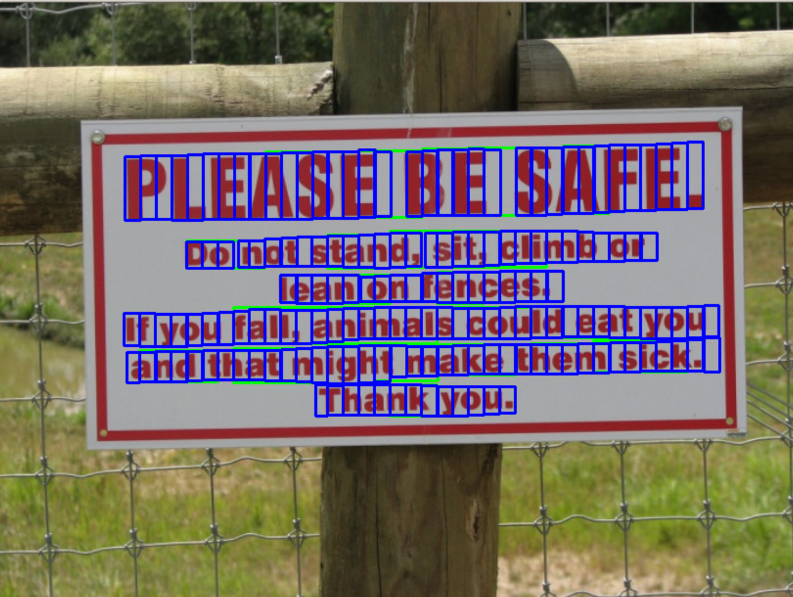
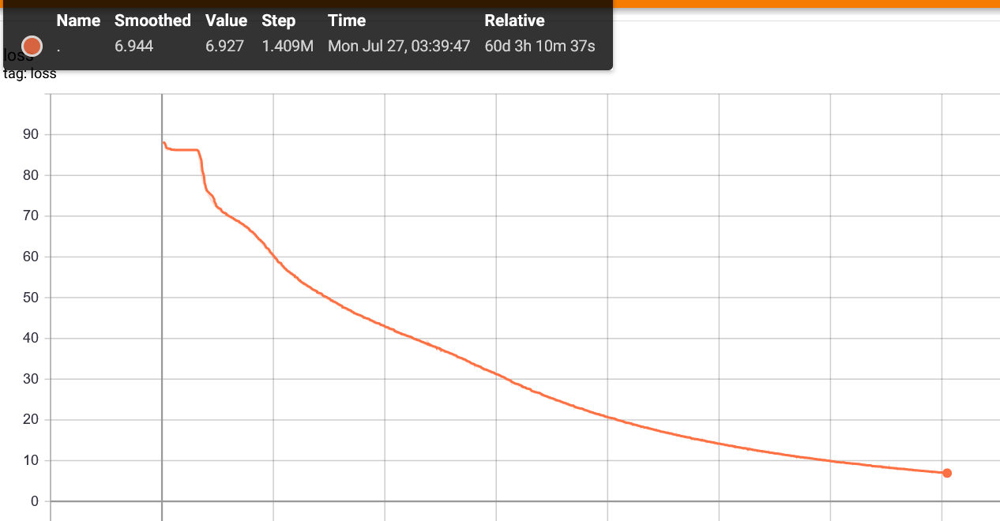
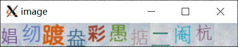
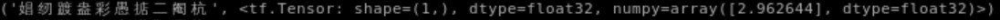
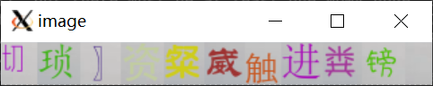
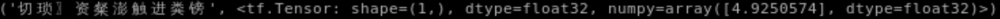
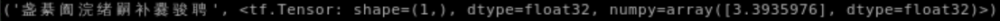

# OCR-tf2
this project implements text area detection and OCR

## download the dataset for text area detection

download the dataset prepared by the author of the paper "Detecting Text in Natural Image with Connectionist Text Proposal Network" [here](https://pan.baidu.com/s/1nbbCZwlHdgAI20_P9uw9LQ)

## create dataset for text area detection

create with the following command

```bash
python3 create_dataset.py <path/to/mlt directory>
```

## train the text area detector

train with the following command

```bash
python3 train.py ctpn
```

when the training process finishes, it will save the parameters in hdf5 format automatically. if you interrupt the training process, you can save the model with the following command

```bash
python3 save_model.py ctpn
```

## test the text area detector

test the detector with

```bash
python3 TextDetector.py <path/to/the/picture>
```

## text area detection results

here are some results of my model which is enclosed at model/ctpn.h5 .

<p align="center">
  <table>
    <caption>Loss</caption>
    <tr><td></td></tr>
  </table>
</p>
<p align="center">
  <table>
    <caption>Detection results</caption>
    <tr>
      <td></td>
      <td></td>
    </tr>
    <tr>
      <td></td>
      <td></td>
    </tr>
  </table>
</p>

## train the ocr

the OCR part of the project is an implement of CRNN introduced in paper "An End-to-End Trainable Neural Network for Image-based Sequence Recognition and Its Application to Scene Text Recognition" . train the model with the following command

```bash
python3 train.py ocr
```

save the trained model with command

```bash
python3 save_model.py ocr
```

## ocr results

<p align="center">
  <table>
    <caption>Loss</caption>
    <tr><td></td></tr>
  </table>
</p>
<p>
  <table>
    <caption>Detection results</caption>
    <tr>
      <td></td>
      <td></td>
    </tr>
    <tr>
      <td></td>
      <td></td>
    </tr>
    <tr>
      <td></td>
      <td></td>
    </tr>
  </table>
</p>
